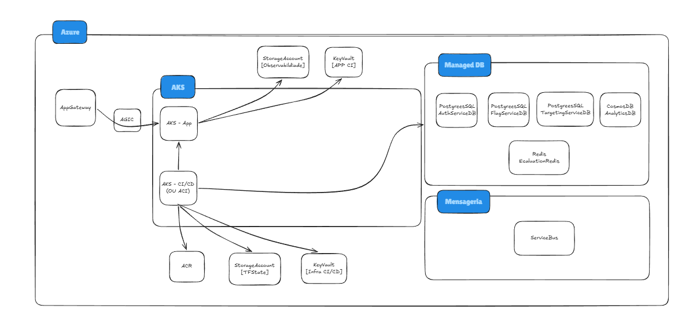
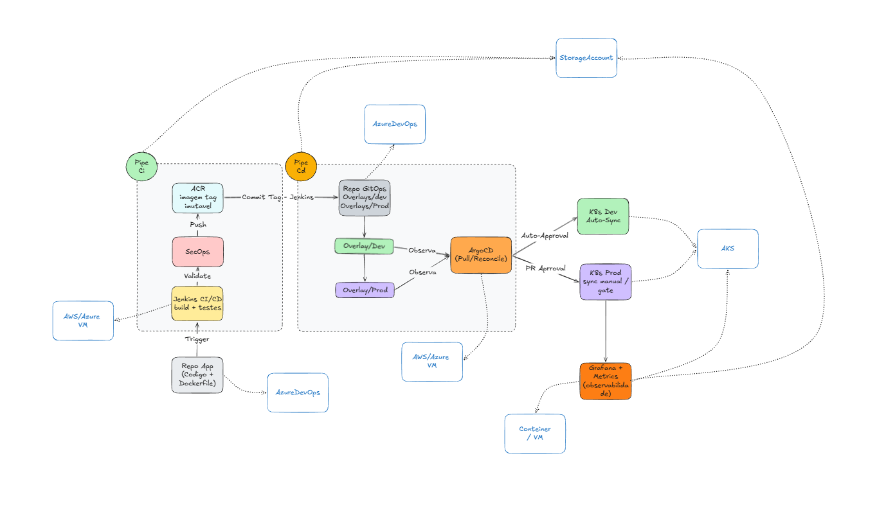

# ToggleMaster — Tech Challenge Fase 3

Sistema de **feature flags** em arquitetura de microsserviços, rodando em **Azure Kubernetes Service**,
provisionado por **Terraform**, entregue por **GitOps com Argo CD** e construído por uma esteira de
**CI/CD DevSecOps no Jenkins**.

**🔗 Links do Projeto**

- 🎬 **Vídeo de Demonstração:** [Link do Vídeo](https://www.youtube.com/watch?v=U7REFyUZ9BQ)
- 💻 **Repositório da Aplicação:** [FIAP - ToggleMaster F3](https://dev.azure.com/Oh20Tony/FIAP%20-%20TechChallenge/_git/FIAP%20-%20ToggleMaster%20F3) — código dos 5 microsserviços, Dockerfiles e os três `Jenkinsfile`
- 🏗️ **Repositório de Infraestrutura (IaC):** [terraform - F3](https://dev.azure.com/Oh20Tony/FIAP%20-%20TechChallenge/_git/terraform%20-%20F3) — Terraform do ambiente Azure ([runbook](IaC/README.md))
- 🚀 **Repositório de GitOps:** [TCF3 - K8S](https://dev.azure.com/Oh20Tony/FIAP%20-%20TechChallenge/_git/TCF3%20-%20K8S) — manifestos Kustomize observados pelo Argo CD ([runbook](infra/README.md))

---

## 📌 Visão Geral

Na Fase 2 o ToggleMaster deixou de ser um monolito e passou a rodar como cinco microsserviços em
contêineres no AKS, com deploy feito por um pipeline que aplicava manifestos direto no cluster.

Na **Fase 3** o alvo deixou de ser a aplicação e passou a ser **a forma de entregá-la**. Três mudanças
estruturais:

1. **A infraestrutura virou código.** O ambiente inteiro — rede, AKS, bancos, mensageria, cofres,
   observabilidade — é descrito em Terraform e sobe do zero com um `apply`. Nada mais é criado pelo portal.
2. **O deploy virou GitOps.** Nenhum pipeline aplica manifesto no cluster. O pipeline só escreve a tag da
   imagem no repositório de GitOps; quem reconcilia o estado do cluster com o Git é o **Argo CD**.
3. **A segurança entrou na esteira.** Secret scanning, SAST, SCA, scan de contêiner, IaC scan, SBOM e DAST
   rodam a cada build, com os achados centralizados no DefectDojo e um **Quality Gate que reprova o build
   antes do push ao registry** quando há vulnerabilidade crítica.

Requisitos técnicos cobertos:

- Orquestração de contêineres com Kubernetes (`AKS`) e Ingress gerenciado (`AGIC`).
- Infraestrutura como código versionada e reprodutível (`Terraform`).
- Entrega contínua declarativa (`Argo CD`, padrão App-of-Apps).
- Comunicação síncrona (HTTP interno) e assíncrona (`Service Bus`) entre microsserviços.
- Persistência poliglota: relacional, NoSQL e cache em memória.
- Escalabilidade horizontal automática por CPU (`HPA`).
- Pipeline DevSecOps com gate de vulnerabilidades e gate de cobertura de testes.

---

## 🗂️ Organização dos Repositórios

A separação em três repositórios é o que torna o GitOps possível: o repositório que o Argo CD observa
precisa ser diferente do repositório de código, senão todo commit de aplicação dispararia uma reconciliação.

| Repositório | Conteúdo | Quem consome |
| --- | --- | --- |
| `FIAP - ToggleMaster F3` | Código dos 5 serviços, Dockerfiles, pipelines Jenkins, scripts de teste, coleção Postman | Jenkins |
| `terraform - F3` | `bootstrap/`, `modules/`, `env/`, scripts de bootstrap do cluster, pipeline de infra | Jenkins / Terraform |
| `TCF3 - K8S` | `base/`, `overlays/{dev,prod}/`, `argocd/` | Argo CD |

---

## 🏗️ Arquitetura da Solução

Toda a stack é Azure, o que mantém a integração entre os recursos simples (identidade gerenciada, RBAC,
diagnostic settings) e concentra a gestão de custo em um único lugar.

### Componentes

- **Azure Kubernetes Service (AKS):** orquestra os *Pods* dos 5 microsserviços (`auth`, `flag`, `targeting`,
  `evaluation` e `analytics`). Dois node pools: `systempool` (1 node) e `apppool` (2 nodes), ambos
  `Standard_D2as_v7`, com autoscaler até 2 e 3 nodes respectivamente. Rede com **Azure CNI** e
  `network_policy = azure`.
- **Application Gateway + AGIC:** o addon `ingress_application_gateway` provisiona o gateway em subnet
  dedicada e instala o **Application Gateway Ingress Controller**, que traduz o objeto `Ingress` do
  Kubernetes em regras do gateway. Como a rede é Azure CNI, o tráfego vai **direto ao IP do Pod**, sem
  passar por um `LoadBalancer` do Kubernetes — os `Services` permanecem `ClusterIP`, privados ao cluster.
- **Azure Database for PostgreSQL Flexible Server:** **três servidores independentes** (`auth_db`,
  `flags_db`, `targeting_db`), um por microsserviço, garantindo isolamento real de dados. Acesso público
  com regras de firewall e `sslmode=require`; a senha é gerada pelo Terraform e gravada no Key Vault.
- **Azure Cache for Redis (Basic C0):** usado exclusivamente pelo `evaluation-service` para guardar o estado
  combinado das flags, cortando a latência e o número de chamadas aos bancos relacionais. Somente TLS
  (porta 6380), política `allkeys-lru`.
- **Azure Service Bus (Standard):** *broker* da fila `togglemasterqueue`. O `evaluation-service` publica o
  evento de uso da flag sem bloquear a resposta ao cliente.
- **Azure Cosmos DB (serverless):** consumido pelo `analytics-service`, que lê a fila e persiste os eventos
  em esquema flexível. Partição por `/flag_name`.
- **Azure Container Registry (Standard):** guarda as imagens dos 5 serviços. `admin_enabled = false` — o
  kubelet do AKS puxa as imagens pela role **AcrPull** atribuída à identidade do cluster, sem senha em
  lugar nenhum.
- **Azure Key Vault (dois cofres):** `[APP CI]` guarda os segredos que a aplicação consome (lido pelos Pods
  via **CSI Secrets Store driver**, com rotação a cada 5 min) e `[Infra CI/CD]` guarda os segredos da
  esteira. Ambos com **RBAC**, não access policies.
- **Storage Accounts:** uma para o **state remoto do Terraform** e outra para o arquivamento de logs de
  observabilidade.
- **Log Analytics Workspace:** recebe logs e métricas do cluster pelo addon `oms_agent`, com diagnostic
  settings do AKS apontadas para ele. Retenção de 30 dias.

> **Nota de região:** os Flexible Servers do PostgreSQL ficam em `eastus2` e o restante do ambiente em
> `eastus`. Não é escolha de arquitetura — o provisionamento de PostgreSQL está bloqueado em `eastus` nesta
> subscription. Detalhes e demais restrições em [`IaC/README.md`](IaC/README.md).

---

## 🔄 Fluxo da Aplicação (Hot Path)

1. **Requisição externa:** o cliente chama a API no IP público do Application Gateway.
2. **Roteamento Ingress:** o AGIC encaminha `GET /evaluate` para um Pod do `evaluation-service`. O mesmo
   Ingress publica `/flags`, `/rules`, `/validate` e `/admin`.
3. **Validação de cache:** o `evaluation-service` consulta o Redis. Em *cache hit*, pula o passo 4.
4. **Comunicação síncrona:** em *cache miss*, o `evaluation-service` chama por HTTP interno o
   `flag-service` e o `targeting-service`. **Ambos** validam a API Key chamando `GET /validate` no
   `auth-service` antes de responder. O resultado combinado volta para o cache.
5. **Retorno ao cliente:** a decisão da flag é calculada e devolvida em JSON (`200 OK`).
6. **Mensageria assíncrona:** sem atrasar a resposta, o `evaluation-service` publica o evento de avaliação
   na fila do Service Bus.
7. **Consumo e persistência:** o `analytics-service` consome a mensagem e só confirma (`complete`) **após**
   gravar com sucesso no Cosmos DB — se a gravação falhar, a mensagem volta para a fila.

---

## ⚙️ Esteira de CI/CD

O Jenkins é o orquestrador. **Toda ferramenta roda em contêiner** — o agente Jenkins precisa apenas de
Docker e Git, sem Go, Python, Terraform ou Trivy instalados.

A fronteira entre CI e CD é rígida: **nenhum pipeline aplica manifesto no cluster.** O CI termina quando a
imagem está no ACR e a tag foi commitada no repositório de GitOps. Daí em diante quem age é o Argo CD.

### Pipelines

| Arquivo | Papel |
| --- | --- |
| `app/Jenkinsfile` | CI/CD do dia a dia. Por serviço alterado: build, testes unitários, lint, SAST, SCA, build e scan da imagem, push no ACR, atualização da tag no GitOps |
| `app/pipeline_unit_tests.jenkinsfile` | Check rápido: os 5 serviços em paralelo + quality gate de cobertura |
| `app/pipeline_devsecops.jenkinsfile` | Varredura de segurança completa, centralização no DefectDojo e gate consolidado |
| `IaC/pipeline_infra.jenkinsfile` | Terraform ponta a ponta (`init` → `validate` → `plan` → aprovação → `apply`) e bootstrap do cluster (Argo CD, Secrets, migrations) |

### Etapas do pipeline DevSecOps

| # | Etapa | Ferramentas |
| --- | --- | --- |
| 1 | Shift-Left: segredos, IaC e Dockerfiles | Gitleaks, Trivy IaC (Terraform + K8s), Hadolint |
| 2 | Linter & SAST | golangci-lint + gosec (Go), flake8 + bandit (Python), Horusec (consolidado) |
| 3 | SCA — dependências | Trivy FS |
| 4 | SBOM, build e scan da imagem | Trivy Image |
| 5 | DAST | OWASP ZAP Baseline |
| 6 | Centralização dos achados | DefectDojo (um *engagement* por build) |
| 7 | **Quality Gate** | Reprova em `CRITICAL` — **antes** do push ao ACR |
| 8 | Push no ACR | `docker login` com a App Registration |
| 9 | GitOps | Commit da nova tag no overlay do Kustomize |

O gate roda na etapa 7, **antes** da 8, por decisão explícita: imagem reprovada nunca chega ao registry.
O parâmetro `IGNORAR_SEM_CORRECAO` (ligado por padrão) faz o Trivy considerar apenas vulnerabilidades com
patch disponível — sem ele o gate trava em CVEs das imagens base que não têm correção publicada e deixa de
ser acionável.

### Testes unitários

Os 5 serviços rodam em paralelo, cada um em seu contêiner. **Nenhum teste sobe Postgres, Redis, Service Bus
ou Cosmos DB** — todas as dependências externas são dubladas no próprio código de teste, o que mantém a
suíte na casa dos segundos e determinística. A lógica de execução vive em `app/scripts/ci/test-go.sh` e
`test-python.sh`, compartilhada entre o Jenkins e a máquina do desenvolvedor.

O gate de cobertura tem mínimo por serviço, porque a base de comparação é diferente: nos serviços Go o
`main()` é *wiring* de startup que teste unitário não alcança e responde por cerca de 30% das linhas.

| Serviço | Linguagem | Cobertura atual | Mínimo |
| --- | --- | --- | --- |
| `auth-service` | Go | 61,0 % | 55 % |
| `evaluation-service` | Go | 66,5 % | 60 % |
| `flag-service` | Python | 94 % | 85 % |
| `targeting-service` | Python | 94 % | 85 % |
| `analytics-service` | Python | 80 % | 75 % |

### GitOps com Argo CD

O padrão é **App-of-Apps**: um único `root-app.yaml` é aplicado à mão uma vez, no bootstrap. Ele observa
`argocd/apps/` e cria sozinho as 7 `Applications` (os 5 serviços, a plataforma e um app de teste). A partir
daí, **adicionar ou alterar app é commit** — o Argo reconcilia.

- Os manifestos usam **Kustomize** com bases em `base/<serviço>/` e overlays em `overlays/{dev,prod}/`, que
  ajustam namespace e tag da imagem.
- Os apps `analytics` e `evaluation` declaram `ignoreDifferences` em `spec/replicas`: o campo é gerenciado
  pelo HPA, e sem isso o `selfHeal` reverteria o autoscaling e o app ficaria `OutOfSync` para sempre.
- **Secrets e migrations ficam fora do Git.** `secret.example.yaml` e `migration-job.yaml` não entram nas
  bases — vêm do Key Vault e dos Jobs disparados pela esteira.

---

## 📈 Escalabilidade

O `evaluation-service` e o `analytics-service` têm **HorizontalPodAutoscaler** por utilização de CPU:

| Serviço | Alvo | Réplicas |
| --- | --- | --- |
| `evaluation-service` | 50 % de CPU | 1 → 5 |
| `analytics-service` | 70 % de CPU | 1 → 5 |

São os dois pontos de pressão reais da arquitetura: o `evaluation-service` está no caminho quente de toda
requisição externa, e o `analytics-service` acompanha o volume da fila. Os demais serviços (`auth`, `flag`,
`targeting`) rodam com `replicas: 1` fixo — são chamados apenas em *cache miss* e não justificam autoscaling
dentro da quota de vCPU disponível na subscription.

No nível do cluster, os dois node pools têm **cluster autoscaler** ligado (`systempool` 1→2,
`apppool` 2→3). O teto é imposto pela quota da subscription: 10 vCPU na família `Dasv7`, ou seja, no máximo
5 nodes de 2 vCPU.

> **Escopo:** o autoscaling é baseado em **métricas de CPU**. Escalar pelo tamanho da fila do Service Bus
> exigiria o **KEDA**, que não faz parte desta entrega.

---

## 🔐 Segurança e Segredos

- **Nenhum segredo no código.** A senha do PostgreSQL, a master key e a service API key são geradas pelo
  Terraform (`random_password`) e gravadas no Key Vault.
- **Pods leem do Key Vault** pelo CSI Secrets Store driver, com rotação automática a cada 5 minutos.
- **ACR sem usuário admin.** Autenticação por identidade gerenciada e role `AcrPull`.
- **Terraform autentica por App Registration**, com client secret ou **OIDC/workload identity federation**,
  sempre por variável de ambiente — o bloco `backend` não aceita variáveis, então qualquer alternativa
  viraria hardcode.
- **Key Vault com RBAC**, não access policies.
- **Gitleaks** roda como primeira etapa da esteira, antes de qualquer build.

---

## 📊 Observabilidade

O addon `oms_agent` envia logs e métricas do AKS para o **Log Analytics Workspace**, e as diagnostic
settings do cluster arquivam em uma Storage Account dedicada, com retenção de 30 dias. Os relatórios de
teste (JUnit + Cobertura) e os relatórios de segurança são arquivados como artefatos a cada build do
Jenkins, e os achados de segurança ficam consultáveis no DefectDojo por *engagement*.

---

## 💰 Estimativa de Custos

Valores mensais estimados para o ambiente como está declarado no `IaC/env/toggle.tfvars`.

| Descrição | Serviço Azure | Mensal (est.) | Observações |
| --- | --- | --- | --- |
| **Orquestração de contêineres** | AKS (tier `Free`) | R$ 724,82 | 3 nodes `Standard_D2as_v7` (2 vCPU / 8 GB): 1 no `systempool` + 2 no `apppool`, escalando até 5 |
| **Ponto de entrada (Ingress)** | Application Gateway `Standard_v2` | R$ 755,02 | SKU exigido pelo AGIC. **Não inclui WAF** — este depende do SKU `WAF_v2`, com custo adicional |
| **Bancos relacionais** | PostgreSQL Flexible Server | R$ 192,53 | Total dos **3 servidores** `B_Standard_B1ms` (1 vCore cada, um por microsserviço) |
| **Cache em memória** | Azure Cache for Redis `Basic C0` | R$ 241,61 | Nó único, sem réplica e **sem SLA** — dimensionado para laboratório. HA exigiria o tier `Standard` |
| **Mensageria assíncrona** | Azure Service Bus `Standard` | R$ 6,21 | A cota de operações do tier cobre o volume do projeto |
| **Banco NoSQL** | Azure Cosmos DB `serverless` | R$ 2,59 | Cobrança por RU consumida |
| **Registry de imagens** | Azure Container Registry `Standard` | R$ 25,85 | 5 imagens, poucas tags retidas |
| **Total cotado** | — | **R$ 1.948,63** | — |
| Key Vault, Log Analytics e Storage | — | *não cotado* | Custo marginal no volume do projeto; o Log Analytics cresce com a ingestão de logs |

> O `Standard_D2as_v7` custa cerca do dobro do `Standard_B2s` usado na Fase 2. Não foi escolha: a família
> B x86 não é oferecida nesta subscription. Somando Application Gateway, três Flexible Servers e Redis, uma
> subscription *Azure for Students* não sustenta o ambiente ligado o mês inteiro — rode `terraform destroy`
> entre as sessões de trabalho.

---

## 🚀 Como Subir o Ambiente

O caminho completo, com pré-requisitos e verificação de cada etapa, está no runbook
[`IaC/README.md`](IaC/README.md). Resumo:

1. **Bootstrap do state:** `terraform apply` em `IaC/bootstrap/` cria o Resource Group e a Storage Account
   do state remoto.
2. **Infraestrutura:** `terraform apply -var-file=toggle.tfvars` em `IaC/env/` sobe o ambiente inteiro.
3. **Imagens:** o pipeline do Jenkins constrói e publica os 5 serviços no ACR.
4. **Cluster:** os scripts em `IaC/scripts/` instalam o Argo CD, criam os Secrets a partir do Key Vault,
   rodam as migrations e registram a chave de serviço.
5. **Aplicação:** `kubectl apply -f argocd/root-app.yaml` — uma vez só. O resto é Git.

As etapas 2 e 4 estão automatizadas em `IaC/pipeline_infra.jenkinsfile`: um build com `ACAO=apply`
provisiona o ambiente **e** entrega o cluster pronto.

---

## 🎯 Conclusão

A Fase 2 resolveu o acoplamento da aplicação; a Fase 3 resolveu o acoplamento do **processo**.

O ambiente deixou de ser um conjunto de recursos criados à mão e passou a ser um artefato versionado: sobe
do zero em um `apply`, é destruído sem medo e volta idêntico. O deploy deixou de depender de um pipeline com
credencial de cluster e passou a ser uma consequência do estado do Git — se alguém alterar algo no cluster
pela linha de comando, o Argo CD desfaz. E a segurança deixou de ser uma revisão no fim para se tornar um
gate que reprova o build antes que a imagem chegue ao registry.

Os segredos saíram do `.env` e foram para o Key Vault, lidos pelos Pods sob rotação automática. As
migrations viraram Jobs do Kubernetes. A cobertura de testes virou critério de aprovação, não relatório.

O que ficou de fora, conscientemente: **KEDA** para escalar pela profundidade da fila, **WAF** no
Application Gateway (exigiria o SKU `WAF_v2`) e **private endpoints** no PostgreSQL — os três são o próximo
passo natural, e estão registrados como pendência em [`IaC/README.md`](IaC/README.md).

---

| Aluno | RM |
| --- | --- |
| Antony Matheus L Nascimento | 370340 |
| Daniel da Silva Junior | 370558 |
| Evandro Gomes da Silva | 373593 |
| Juan Rodrigues | 373074 |
| Gabriel Mota | 373164 |
